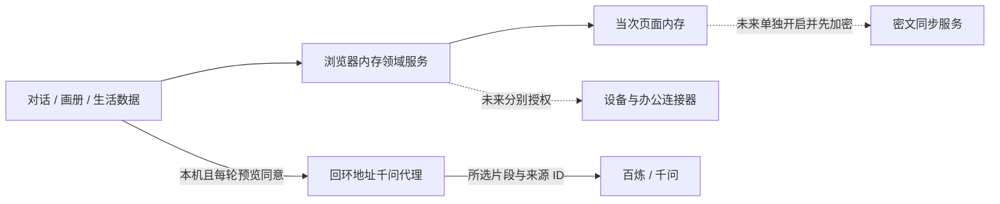

# 心灵画册架构与前后端协议 v1

**状态：默认对话与画册已经接入浏览器内存领域服务；本机私人提问与逐轮模型聊天是独立的可选试验。** `src/features/free/FreeTrial.tsx` 在 React 内存中组合三页；`src/domain/browserLocalSession.ts` 调用 `backend/local/` 记录、日页、问句候选采纳与纠正服务，再投影给界面。`src/domain/invitations.ts` 仍处理演示邀请，`DataInsights.tsx` 的三项图表仍是固定合成数值与模拟开关。未发送的自由输入随刷新或清除丢失；已明确同意交给提供方的片段不受这一页面清除动作控制。本文和 [OpenAPI 3.1 契约](../contracts/api-v1.yaml)为后续开发及队友优化前端提供共同边界，**不表示账号、真实设备读取、生产级云分析或安全持久化已经实现**。阿禾的[合成 AI 实验](../contracts/ai-experiment.md)已有一次固定合成数据真实模型调用；[本机私人提问](../contracts/private-question-pilot.md)与[逐轮对话](../contracts/private-chat-pilot.md)要分别验收，阿禾结果不能互作授权或效果证明。

## 1. 架构决定

记录的默认路径留在设备上。当前比赛 Demo 的“本地记录库”只是页面内存；真实基础版才用系统 Keychain／Keystore 保护密钥和设备加密数据库。纯网页没有此保护，不能直接把 Demo 的内存逻辑或浏览器持久存储包装成正式敏感数据保险箱。本机私人提问与逐轮聊天分别由 `-EnablePrivateQuestions` 和 `-EnablePrivateChat` 开启，均需用户在每次页面弹窗确认片段后才发送；拒绝、断网或模型失败时原话仍留在本地，规则模式仍可用。跨设备密文同步仍是**独立且未实现**的出站通道，不能把聊天许可当成同步许可。百炼可能存储调用数据；本机内存清除不等于提供方删除。

产品 SPA 无法直接读取系统范围的手表步数／心率、手机消费记录或其他应用的时长。未来需要原生手机／手表应用或获授权的数据提供方连接器，先获得对应系统／提供方权限，再按来源和用途取得应用内许可，优先在设备端汇总为必要的日级数值。照片用系统选择器只选用户指定的内容。千问办公仅列为将来独立连接器：还要处理企业权限、同事资料、保密边界与逐项授权；v1 不接入、不默认搜索办公记录。

### 实施顺序与所有权

| 阶段 | 范围 | 当前状态 |
| --- | --- | --- |
| 0 前端 Demo | 三页、默认规则问答、当次页面记录、模拟图表 | 已实现；默认不发送私人内容，也无账号或真实设备权限。 |
| 1 本地领域层 | 记录、日页、编辑删除、候选题采纳与纠正；正式端需加密本地库 | 浏览器与 Node 均可运行内存核心；网页已接入消息、日页、编辑删除、纠正及后续问句。邀请、模拟授权仍各走演示规则；加密持久化和生产端待开发。 |
| 2 本机可选模型提问 | 每次预览确切 `quote`、来源 ID 与修订号，用户同意后向本机代理发送；版本复核后才采纳 | 代码已接线并通过合成资料与假 provider 回归；服务端须 `-EnablePrivateQuestions` 单独开启，未用真实私人内容进行上游调用。GitHub Pages 静态版没有此路由。 |
| 2a 本机逐轮模型聊天 | 自然输入先本地保存；每轮预览本句、最多两段旧原话和可选的上一轮回应，独立同意后生成聊天回复与可空追问 | 本机独立路由，须 `-EnablePrivateChat`；模型回复不写成用户日记事实。编辑／删除来源撤下依赖回复。真实模型调用证据与对话质量需要单独验证。 |
| 2b 生产级云分析 | 身份认证、逐次许可证明、正式隐私与数据删除方案 | 仅未来协议；不能把本机回环试验当成生产服务。 |
| 3 连接器与跨设备 | 来源分别授权；另行选择账户和客户端密文同步 | 蓝图；不应以模拟开关声称已接入。 |

前端优化可改布局、组件与动效，但不要复制第二份记录正文或改变 `browserLocalSession`／`backend/local` 的事实语义。后续接入实际能力时，不要把模拟“第 N 天”、旧规则或 `ahe` 合成资料直接迁移为生产数据。

### 当前内存实现的准确范围

`backend/local/` 已提供空间事务、消息与日页、引用题干、编辑／删除、模型候选题采纳、针对待答模型题的用户纠正、控制消息删除、邀请节奏和应用内来源许可。`npm run demo:backend` 只用固定合成内容展示部分转移；默认网页经浏览器内存适配层使用消息、日页、记录编辑删除、纠正影响下一问等能力，**不等于其余服务也已接线**。`Question.approvedExcerpt` 记录本次实际获准发送的精确片段，供当前题与已回答历史题折叠核对；它是 `Entry.text` 的受来源约束副本，来源改写／删除时须与题干在同一事务清除。用户在较晚演示日纠正旧日原话相关的模型题时，观察归实际纠正日的画册，引用仍指向旧日原话；旧日来源失效时，纠正日的观察撤下，若该日再无有效内容则日页也消失。网页的跨日摘录须由用户从当前页和较早日各选一条，不能从通用 `daily-note` 标签推断同一主题。事务缓存仅保留请求摘要；修改或删除私人文字后清除旧响应，旧操作 ID 仍保留为无正文的防重放标记。内存适配器随页面刷新或进程退出消失，不能代替加密本地数据库或多设备同步。

本地规则提问只接受 `open`、`moment`、`reflection` 模板；若引用已有记录或纠正后的观察，题干由服务按核验过的引用生成。`adoptCloudQuestion` 是独立的受版本约束事务，只能把当前最新、未回答、单条有效引用的规则题替换成候选并标为 `cloud_model`，同时冻结该次 `approvedExcerpt`；不会把模型输出直接写成事实。本机代理只验证请求格式、配额和模型回复，**没有浏览器空间快照，不能判断提交的 revision 是否仍为当前版本**；浏览器本地适配器在发送前与返回后检查，领域事务在采纳时再次原子验证。`recordQuestionCorrection` 撤下被否定的待答模型题，以 `correctedAt` 派生实际纠正日，并保存用户自己的有来源纠正；下一条规则题可引用这条纠正。`sendMessage.closeRound` 是界面内部的整轮结束信号，不是用户要点击的行为模式；邀请创建时冻结每日两题或每周一题的题数，服务核验消息绑定本轮最后展示的题，发送与结算在同一事务。用户明确说结束可提前结算。跳过当前题后，界面需另行调用 `displayQuestion` 显示下一题。删除某题的回答会清除正文和回答关联，但保留已展示题目的安全占位，整轮仍可结束；有更新轮次时，旧邀请上下文不得继续写入。用户只看到首题却整天没有回应，次日本地被动结算仍计一次未回应；查询或历史翻页不会代替结算。已结算轮次可以改判并修正其回应状态；若原自动降频尚未生效则撤销，已生效降频只标记被纠正，不会自动升档，已生效事件用过的邀请不能再次触发降档。领域层的整空间清除、来源数据导入／删除、加密存储、生产级云分析和同步尚未实现。网页的“清除”通过丢弃当前浏览器内存空间完成，不能解释为持久库或提供方数据擦除。

## 2. 本地领域协议

这是 UI 对领域服务的**传输无关**契约，可以用 TypeScript 接口实现；不是当前网页会发出的 HTTP 请求。数据结构在 OpenAPI `components.schemas` 中用 `Local*` 标明，供前后端各自生成类型或对照测试。真实记录用不透明 UUID，日页用 IANA 时区的 `YYYY-MM-DD`；`occurredAt` 是带偏移量的发生时间，`recordedAt` 由本地库赋值，绝不复用 Demo 的整数日号。每个可变对象有从 1 开始的 `revision`，写命令带 `expectedRevision`；重试用同一 `clientOperationId` 保持幂等。空间 ID 来自当前认证／设备空间，不信任任意客户端路径参数。

| 命令或查询 | 输入 → 输出 | 必须保持的行为 |
| --- | --- | --- |
| `sendMessage` | `LocalSendMessageRequest` → `LocalSendMessageResult` | 一次事务保存消息、可选记录、已回答／跳过问句及其引用版本、邀请响应状态；最后一题可带内部 `closeRound` 同事务结算。结果明确给出消息 ID、行为解释、问句／邀请 ID、记录 ID 或控制事件，以及规则／模型来源。发送框不要求用户先选“回答／分享／跳过”。意图不确定时保留原话，并默认作为可纠正记录，不自动判拒答。 |
| `adoptCloudQuestion` / `recordQuestionCorrection` | 待答题 ID／期望版本、当前来源 ID／版本、候选题与实际批准片段，或用户纠正文字及 `correctedAt` → 新问句或观察 | 只更新当前有效待答题；候选采纳时冻结 `approvedExcerpt` 供折叠证据查看。纠正文字来自用户本人，归入实际纠正日，来源仍是旧日记录。来源修订、删除、题目状态变化或空间版本变化均拒绝过时操作；纠正撤下旧题干并影响下一问。 |
| `correctInterpretation` | 消息 ID、期望版本、新解释 → 更新的消息／记录／邀请投影 | 用户可把错误的行为判断改正；纠正也需一次事务更新关联记录与邀请，控制表达不因模型判断永久丢失。已结算轮次更新回应状态、撤销尚未生效的错误自动降频；已生效频率留待用户手动调整，纠正事件可见。未来模型的输出只是提议。 |
| `listDays` / `getDay(date)` | 日期范围／日期 → `LocalDayPage` | 只返回有当前有效记录的日期；日页是投影，正文仅来自记录，不另存第二份。按当前授权和引用版本筛选。 |
| `editEntry` / `deleteEntry` | 记录 ID、期望版本（编辑另带全文） → 新版本／删除结果 | 编辑撤下依赖旧原话的观察、标题与索引；删除还撤下修订历史和派生摘要。任一关联问句引用被修改或删除时，整条旧题干都替换成无私人原话的“引用已修订／已删除”提示，不能只遮住其中一个引文。迟到模型响应不能复活来源。更改标题前先给用户显示受影响日页清单。 |
| `setDayTitle` | 日期、标题、标题期望版本、空间期望版本 → 新标题版本 | 自由标题可能借用任何一天的原话；v1 在版本匹配的设标题事务中，将**空间里所有当前有效记录 ID**与标题旧依赖取并集，客户端不能缩小。后续任一依赖改动都撤下标题；这是有意保守的规则，可能多撤标题，确认界面须显示影响。 |
| `markInvitationShown` / `settleInvitation` / `setCadence` | 邀请 ID／实际展示时间／整轮结果／节奏 → `LocalInvitationState` | 只统计实际展示的一整轮；连续 2 个已展示邀请日未回应才降一档，只降不升。未展示、断网失败、暂停、历史翻页均不计；未回应不是情绪信号。手动变更次日生效，自动降档记录触发的两轮邀请和生效日，用户可查看 `changeEvents`。 |
| `grantSource` / `revokeSource` / `deleteImportedSourceData` | `LocalSourceGrantRequest` 等 → 授权／删除结果 | 对 `source + purpose + scope` 分别处理，采集、写入、读取、检索、分析和出站都重验有效授权版本。撤权立即停后续读取、隐藏该来源及依赖推断；**撤权不等于删除**已导入副本。已导入副本、摘要和索引用独立动作删除。 |
| `getBehaviorSummary` | 来源、日期范围 → `LocalBehaviorSummary` | 未授权不得读取；缺测用 `null`，不当作 0，也不由数值直接推断情绪、健康或人格。 |

本地查询应返回明确错误码：`not_authorized`、`revision_conflict`、`not_found`、`invalid_input`、`source_unavailable`。日页和消息响应以 `spaceRevision` 标识一次原子提交后的状态，UI 只显示同一版本的投影，避免聊天已改而画册仍留旧正文。邀请需有独立的 delivered／shown／settled 幂等事件。问句使用 `citations[]` 保存**全部** `{kind, id, revision}`：可引用原话记录，也可引用有依据的已纠正观察；任一引用本身或其底层记录失效，就原子替换整个旧题干、`approvedExcerpt` 及可能含原话的派生文本，读取和显示均不可回显。云端多引文建议仅在全部引用仍有效时采纳。有记录的消息在进程内从 `Entry.text` 投影正文，`LocalSyncDocument.messages` 使用无复制正文的 `LocalStoredMessage`；已批准片段另在当前有效 `Question.approvedExcerpt` 留一份可核对副本，并受同样的引用失效规则约束；不进画册的控制话语才保留 `controlText`。编辑同时更新 Entry、聊天投影、引用、搜索与待同步快照；**删除记录**优先于历史审计，须从对应消息、有效库、修订、摘要、检索索引、缓存与待处理任务中级联清理，只留不含正文的墓碑阻止离线旧副本复活。备份删除期限须在真实上线前确定并披露。

## 3. 可选远端 API

OpenAPI 的 HTTP 路径只对应两类**未来可选**远端服务：

另有三条独立的**本机试验端点**：`POST /api/ai/synthetic-question` 严格只接受 `{ "scenario": "ahe" }`，服务端使用固定版本合成资料；`POST /api/ai/private-question` 处理单次获准原话的后续题，见[私人提问试验契约](../contracts/private-question-pilot.md)；`POST /api/ai/private-chat` 处理逐轮获准的自然对话，见[逐轮对话契约](../contracts/private-chat-pilot.md)。阿禾真实调用证据不能代替主对话调用证据。这些都不是本节的生产级授权分析协议；无 Key 或地域匹配的模型地址时明确返回未配置，不生成假成功响应。

1. `POST /v1/analysis/proposals`：客户端先预览本次要离开设备的完整消息与选定旧片段、目的及模型提供方，内容变更即重新同意。请求只带这些最小片段、ID／版本、一次性许可收据与幂等键；服务端校验收据绑定的内容摘要，不写正文日志，不把未授权来源加进 Prompt。响应是 `proposal`，不是已经写入日记的事实；引用须匹配当前版本。断网或拒绝时**不发请求**，本地规则照常运行。服务器不能仅凭收据证明真人真的看过预览，客户端的隐私门还需要 UI 和网络测试验证。
2. `GET/PUT /v1/sync/envelopes/current`：用户另行开启账号同步，客户端先加密完整本地状态，服务器只收密文包和必要版本元数据。同步许可不允许服务器解密或调用模型。用 `ETag`／`If-Match` 防止覆盖其他设备的新版本；冲突下载后在客户端解密合并或请用户处理，不使用静默最后写入覆盖。设备配对、恢复密钥与账户服务属于落地前的独立设计／审计内容。

两类 API 都用 TLS、账户 Bearer 凭据和 `Cache-Control: no-store`；鉴权实现按 OIDC Authorization Code + PKCE 设计，不把 token 或模型密钥放进仓库。跨空间访问统一返回无正文的 `404` 或 `403`，不可从错误中枚举他人记录。`Idempotency-Key` 防重试重复处理，错误响应只有码与安全提示，不带原话、Prompt、密钥或上游堆栈。云模型接触该次授权片段的明文，因此**不能宣称所有云端内容都端到端加密**。服务提供方的数据使用、留存、删除与地域要在正式启用前审查。

## 4. 前端交接验收线

- 默认页仍是单一输入框的对话；画册和生活数据独立可达。普通话语不经过行为模式按钮；只保留明确短句的前端规则演示，不把它当真实语义识别。
- 主对话默认先有规则题。仅本机、仅当前有效单条引用，可逐次预览并选取 6–800 字连续原话片段；发送前取消零请求，同意只发这一片段与来源标识；发送后取消只放弃结果并尽可能中止上游，已发内容无法撤回，迟到响应或来源变更不能写回。成功明确标“千问提议”，当前题和已回答历史题的折叠证据能核对 `approvedExcerpt`；来源失效即清除。理解偏差由用户纠正并影响下一问；跨日纠正出现在实际纠正日，依据仍指向旧日原话。GitHub Pages 静态版继续规则模式。
- 本机可切换“千问聊天”：发送框始终接受用户自然话语，不需要“回答／分享／跳过”按钮，也不受本地邀请题数截断。先保存原话，再逐轮预览和同意本句、至多两段有效历史片段与可选上一轮回复；取消不请求模型，失败不伪装成功。模型只生成聊天回复及可空追问，画册继续只收用户原话。任一获准来源改写／删除时依赖回复从界面撤下；上一轮回应失效时，依赖它的后续回复也撤下。
- 三页同一当前页面会话；消息与日页共享领域服务状态，修改／删除立即反映在气泡、日页、对照和打印。邀请与生活数据仍是各自的演示状态；历史回看不结算邀请。
- 跨日摘录由用户从当前页与较早日各选择一条有效原话，主动分享也可选；不因通用主题标签自动推断“变化”。
- 三个图表继续写明固定合成、模拟授权和未连接设备；不触发真实权限或业务请求。`JournalState.sourceConsents`、`DataInsights` 三个布尔值与旧 `GuidedStory` 开关目前彼此独立，**都不是生产授权记录**。
- 若接入本地库与远端服务，先完成上述原子性、授权版本、撤权与删除、隐私门、断网降级及数据隔离测试，再改变界面宣称。真实版不能继续写“刷新即清空／仅本次页面”；真实媒体应使用受控本地引用，不能让任意远端图片 URL 自动请求。不同步的演示状态绝不混入真实空间。
