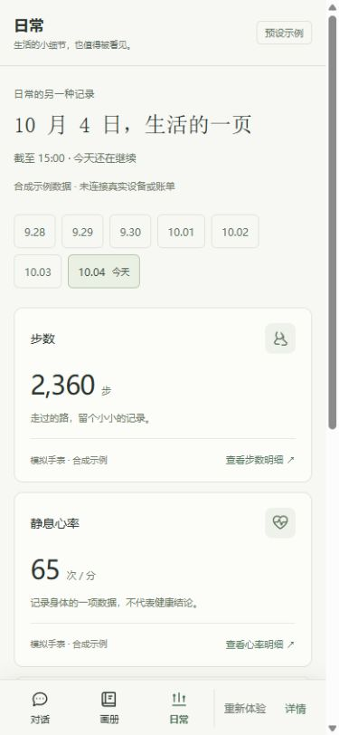

# 渐知日常页

为评委预设体验增加「日常」导航。步数、静息心率、消费去向展示生活中具体的一天；与对话、画册共享伙伴形象和已有交流进度。

## 本轮范围

- 七日合成样例可按日切换，今日为 2026-10-04 截至 15:00 的快照。
- 显示步数、静息心率、日常消费，每项可展开七日趋势和精确数值。消费展示类别组成。
- 每项来源可以单独隐藏，隐藏时同项数值、趋势、表格和数据关怀引用一起消失。开关用于示例显示，不表示设备权限。
- 知知的关心结合已经发送的原话：返程描述在第三轮完成后可用，受到朋友关注的感受在第四轮完成后可用。
- 返回对话和打开今天画册保持五轮进度；等待回复时切换页面不会停止或重复回复。切换页面保留日期和来源选择，重新体验恢复默认。

## 数据口径

所有数值为固定合成样例，未连接手机、手表或账单，不读取私人资料，不请求录音或设备权限，不调用模型。静息心率是记录口径，不提供健康判断。今日未结束，不用今日快照与完整昨日计算活动下降。七日消费分布描述当周记录，不将其写成已识别的长期消费习惯。

本轮数值不自动写入聊天、肖像或 Markdown。真实设备连接、账单导入和长期趋势分析留给后续开发，演示标记始终可见。

## 设计与验证

沿用现有浅灰、柔绿、深色文字与知知形象；日期条、三项简洁记录、关心便笺、按需展开的明细和来源。无打卡目标或生活评分。

单元测试验证日期、来源隐藏、关心与已到达原话的关系。浏览器测试验证等待中切换、画册入口、重置和 320/375px 布局；同时回归原聊天、表情、通话和下一次见面流程。

## 完成验证

- 构建与 lint 通过；全量单元测试 39 个文件、371 项通过。
- 日常、聊天、通话三组浏览器回归共 8 项通过，包含 320px 与 375px 手机布局、等待回复时切换、来源隐藏、画册、Markdown 下载和下一次见面。
- 最后两处文案与手机提示分隔调整后，构建与相关 23 项单元测试再次通过。
- 内置浏览器实测桌面与 390px 手机；四轮对话后，日常页关心引用已确认的返程补充与支持感。七日明细标注今日尚未结束。

