# 渐知：评委视角体验评审

评审日期：2026-10-04。体验地址：http://127.0.0.1:5176/?demo=judge。

本次完整走完五次发送，并体验预设通话、日记、原话与理解、月份目录、跨月搜索、手机尺寸和演示说明。截图均为本次体验新采集。此轮只做评审和方案，未修改产品代码，未同步 GitHub。

后续进展：用户已确认实施四项主要建议，见[四项优化完成记录](judge-upgrade-2026-10-04.md)。以下内容保留为优化前的评审记录。

## 判断

这版已经有亲切、完整的体验雏形。主动开场、自然分条回复、关心用户、接受纠正，以及日记的文字质感，能够形成一个连贯的故事。最值得提升的是核心价值的可见性：评委需要从长对话里自己推导出“它用过历史记录，撤回了错误理解，并留下可核对的新理解”。

优先把这些变化做成可以点开、可以核对的结果，再增加一次简短的后续见面演示。保留现有聊天、知知形象、通话界面、画册视觉与月份目录。

## 赛题依据与核验边界

本次重新查看了用户此前提供的两张官方赛道截图：赛道说明、参赛流程与主题，均摄于 2026-09-23。截图呈现主题“开造未来，让 AI 成真”，智能日常赛道强调让 AI 进入每一天、理解生活。以下判断以这些赛道方向为依据；原截图未随源码分发。

截图中的手机、穿戴属于行业灵感，不能据此认定比赛强制要求硬件接入。截图摄于 9 月 23 日，也不能据此判断目前专项挑战的最终要求。

[天猫官方赛事公告](https://www.sina.cn/news/detail/5340839388643495.html)可以核对赛事鼓励把 AI 创意做成作品的方向。本次未能读取官方活动页的最新完整细则，因此不列官方评分权重，也不作获奖概率判断。下文的赛道匹配、价值可见性、证据、完成度，是本次评审采用的维度。

对于渐知，最有说服力的赛道关联是：用户分享生活片段 → 留下可回看的记录 → 理解能被用户修正 → 修正后的记录帮助下一次交流。当前演示前三部分已经有可见材料，最后一部分尚未直接展示。

## 逐步体验结果

| 步骤 | 操作 | 状态 | 评委感受与问题 | 截图 |
| --- | --- | --- | --- | --- |
| 1 | 进入并阅读知知开场 | 良好 | 无需登录，主动提出具体话题，发送入口明确。尚不能快速知道产品独特价值和主要服务对象。 | 01 |
| 2 | 发送两轮，阅读历史联系 | 基本顺畅 | 引用 10 月 1 日让历史记忆进入当前交流；日期不能点开核对来源。 | 02 |
| 3 | 指出疲惫与聊天无关 | 需突出结果 | 知知撤回猜测，再追问被认真听见的感受；理解变化主要藏在文字里。 | 03 |
| 4 | 进入通话，完成预设转写，返回聊天 | 可用的交互演示 | 原有通话布局完整，进度衔接正常。没有真实录音、语音识别或播放；进入前可更清楚地提示演示性质。 | 04 |
| 5 | 完成第五次发送 | 良好 | 关心和结束语自然，画册入口明确。故事止于一次交流，没有展示下次见面如何受益。 | 05 |
| 6 | 打开今天日记 | 良好 | “还没做完，也有人认真听”能凝练更深层的感受，日记保留用户自己的解释。 | 06 |
| 7 | 切换原话与理解并查看依据 | 信息完整，层级需调整 | 先展开 15 条完整对话，今日肖像位于页面约 2400 像素之后。重要理解容易被跳过。 | 07、08 |
| 8 | 返回月份目录 | 良好 | 年月组织、记录卡片和今天入口适合长期积累，365 条示例已标明性质。 | 09 |
| 9 | 搜索“项目” | 可用，材料需精选 | 能找到跨月结果并加载更多。多条示例标题、内容重复，数量难以体现逐渐理解。 | 10 |
| 10 | 检查手机尺寸和演示说明 | 主路径可用 | 390×844 下目录、聊天结束、说明弹窗可操作。说明诚实披露预设边界，但缺少真实 AI 技术实践的证据。 | 11—13 |

## 优化顺序

### P0-1：把记忆与纠正做成能核对的结果

**位置：引用历史的回复、用户纠正后的回复，以及原话与理解页。**

- 给“10 月 1 日”等历史引用增加小型来源入口，点开当日相关原话，不要求评委离开当前故事寻找记录。
- 纠正后显示一块简洁的理解更新：旧猜测“聊天可能耗神”标记为已撤回；用户明确“与朋友相处很放松”；疲惫可能与回程等待、换乘有关，具体原因仍保留不确定性。
- 对“有人把自己正在做的事放在心上”关联用户原话和确认，不把知知的解释包装成读心。

**参赛意义：**让评委看到有依据、可修正的理解机制。验收时应能从每个重要结论直接点到原话，并清楚分辨已确认、待确认、已撤回。

### P0-2：将今日肖像放到画册背面的第一屏

**位置：原话与理解页。**

首屏先呈现三项：今天发生的事、用户明确表达的感受、这次理解的变化。用简短状态标记区分确认程度。把 15 条完整对话改为可展开的“完整对话”，保留按依据跳转、Markdown 原文和下载入口。

**参赛意义：**评委能在有限时间内看见从对话到理解的结果。验收时首屏能读到今日核心肖像；完整原话仍可查阅，无删改和遗漏。

### P0-3：补一个“下一次见面”的预设片段

**位置：查看画册之后，增加可选的后续演示入口。**

保留五次发送主流程，再安排一个很短的后续片段，使用已经修正的记录。例如知知提起用户被朋友认真听见的经历，给出接着聊项目或换个轻松话题的选择。既不继续使用已经撤回的“聚会耗神”判断，也不假设用户实际完成了休息或项目计划。

这里继续采用明确标注的预设体验，不需要立即建设新的长期记忆后端。

**参赛意义：**直接展示记录如何帮助下一次交流，把智能日常的价值讲完整。验收时评委能指出这次追问用了哪条经过修正的记录。

### P0-4：补上真实 AI 技术实践入口，统一提交身份

**位置：演示详情、参赛说明和视频。**

在现有说明中增加可选的“AI 技术实践”区域，使用已有的真实千问合成数据实验作为证据：[2026-09-29 实验记录](../evidence/2026-09-29-qwen38-flash-synthetic-trial.md)。可展示合成输入、实际输出、引用依据和一次请求的记录。

必须准确区分：当前五轮评委体验是预设；已有真实实验是一次带来源引用的提问；完整跨天理解和持续记忆链路仍需后续实现。单次实验不能证明目前整套演示均由模型实时生成。

旧版参赛文案使用“渐记”，与当前“渐知”不一致。最终方案、视频、封面与 Demo 名称需要按当前用户确定的“渐知”统一。

**参赛意义：**让评委区分设计表达与已完成技术验证。正式提交前另需验证公开体验链接、无登录访问、静态资源和首次加载；本次只检查了本机地址。

### P1-1：让用户掌握理解的修订

原话与理解页目前可以查看，演示 footer 说明真实版本支持编辑与修正，本次 judge 路径没有直接提供编辑。优先考虑“查看修订前后”的固定操作，或者一个受控的本地修订体验，显示改动结果并保留原话。若加入编辑，应让查看、修改后的记录与导出内容保持一致。

这比增加更多形象或装饰更能说明为什么用户可以信任并掌握自己的记录。具体采用哪种方式，应服从固定流程 Demo 的范围。

### P1-2：精选一条跨天故事，降低评委寻找成本

保留现有年/月目录和 365 条示例，作为长期使用布局的展示。主要演示突出 3—5 条相互关联的记录，串起项目、朋友的关注、身体疲惫与被听见的感受。其余批量示例作为可选浏览。

首页的引导可以更直接地点出“记住之前的分享、接受这次纠正、留下一页日记”，避免只解释需要点几次发送。通话界面保持现状，入口可补短提示，避免评委以为自己正在使用真实语音服务。

## 当前值得保留的部分

- 知知主动提出可回答的小话题，用户进入交流的负担较低。
- 分条回复与等待节奏形成接近日常聊天的感觉。
- 用户指出问题后，知知愿意撤回猜测，并继续关心用户的实际经历。
- 日记标题与正文已经把“开心”展开为被认真倾听、被关注的体验。
- 原话、明确感受、暂定观察和依据有区分，能够支撑核对。
- 年月目录、搜索、手机布局已经回应长期积累的展示需求。

## 可访问性与验证边界

本次手机检查采用浏览器 390×844 尺寸，主要路径没有观察到明显裁切；并未覆盖真实手机输入法、所有窄屏状态或操作系统行为。部分说明文字字号偏小、颜色偏浅，建议正式提交前测量对比度并检查键盘焦点；本次不宣称通过 WCAG 或屏幕阅读器检查。

电话按钮、结束通话等图标可以操作，但首次体验者可能需要更直观的动作提示。保留已有布局，以短标签或提示解决。

本次内置浏览器未返回 Markdown 下载完成事件，因此没有复核下载文件；不能据此认定功能失败。正式提交前需要在常规浏览器验证下载及文件内容。

本次未验证公开部署、真实模型调用、真实麦克风、声音播放、外部设备、持续记忆保存、角色切换和单独的语音输入入口。预设通话体验成功不等于这些能力已完成。

## 本次截图

### 01：进入与主动开场

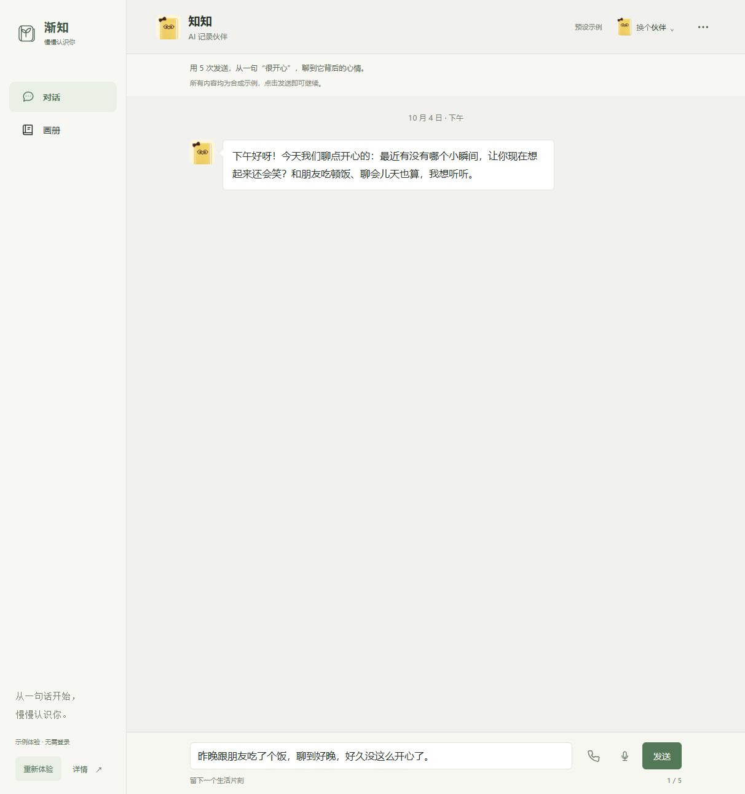

### 02：历史联系

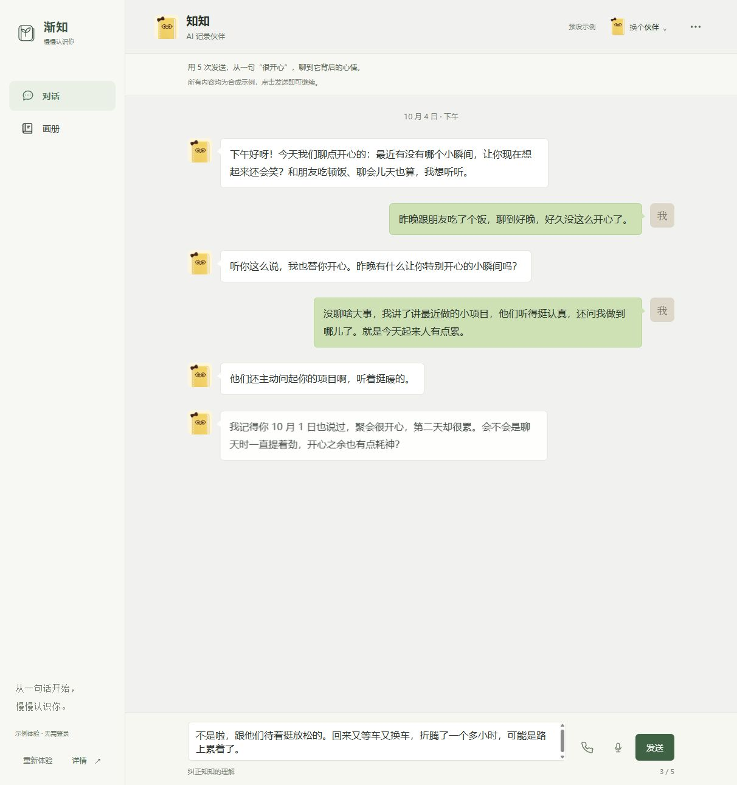

### 03：接受纠正

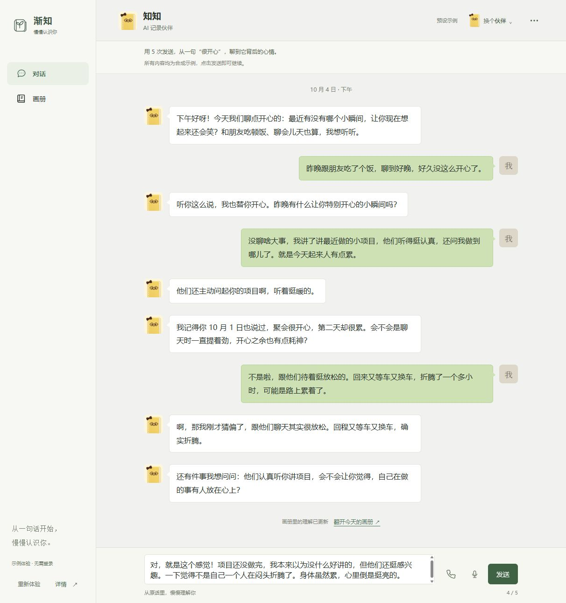

### 04：预设通话

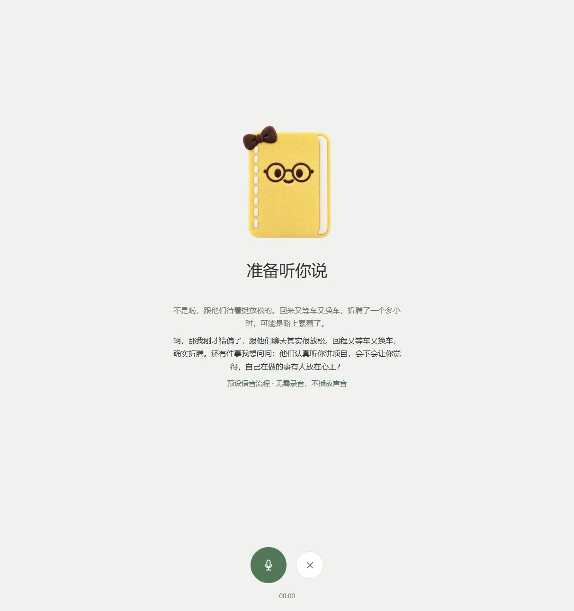

### 05：完成对话

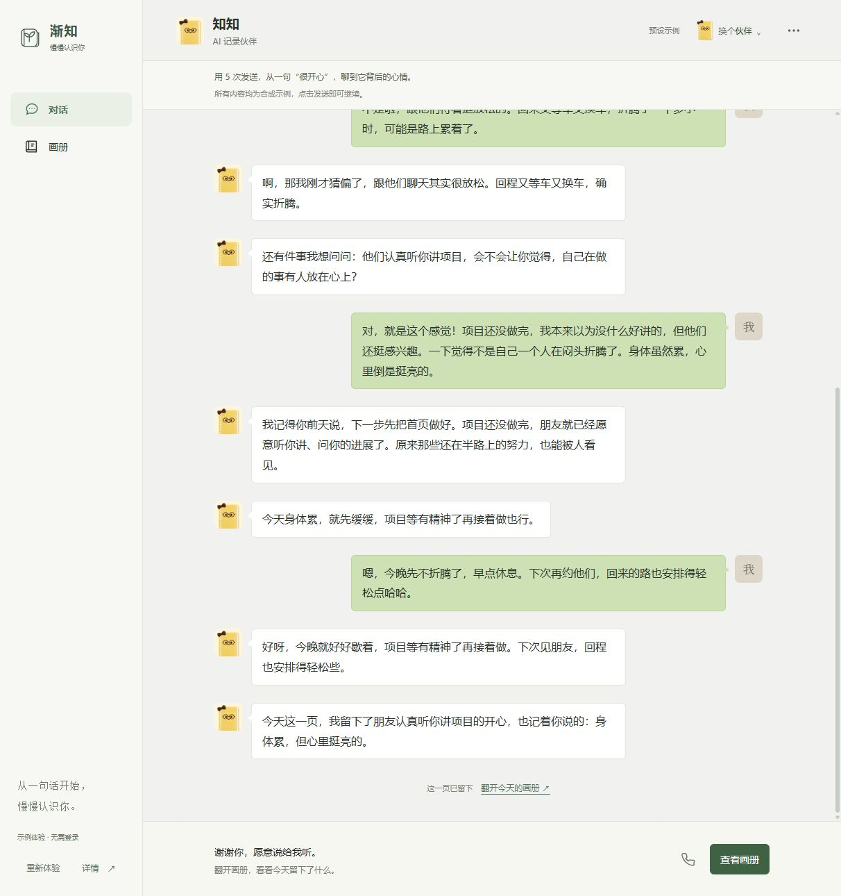

### 06：今天的日记

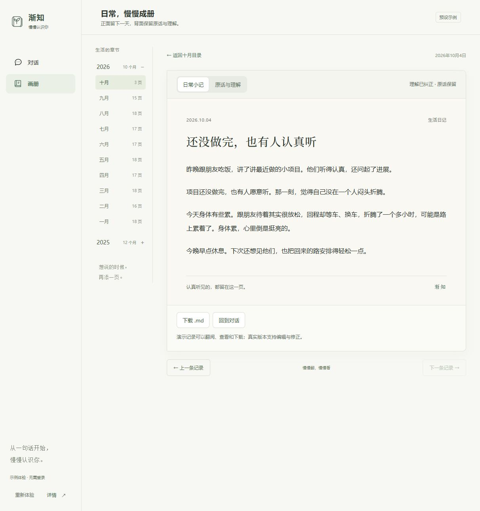

### 07：背面首屏

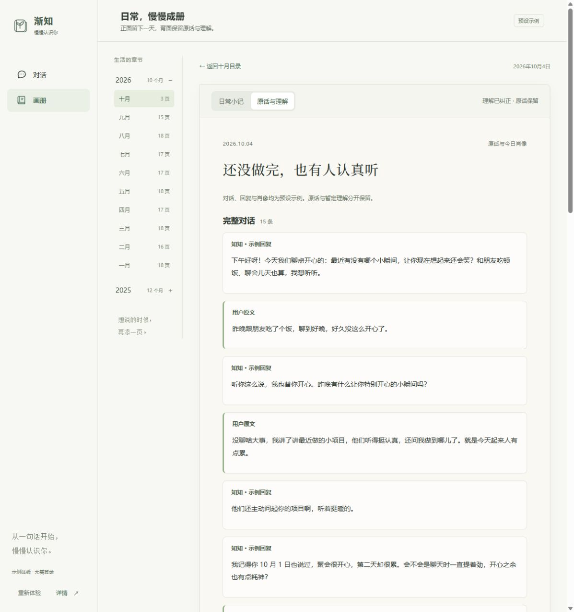

### 08：肖像与依据

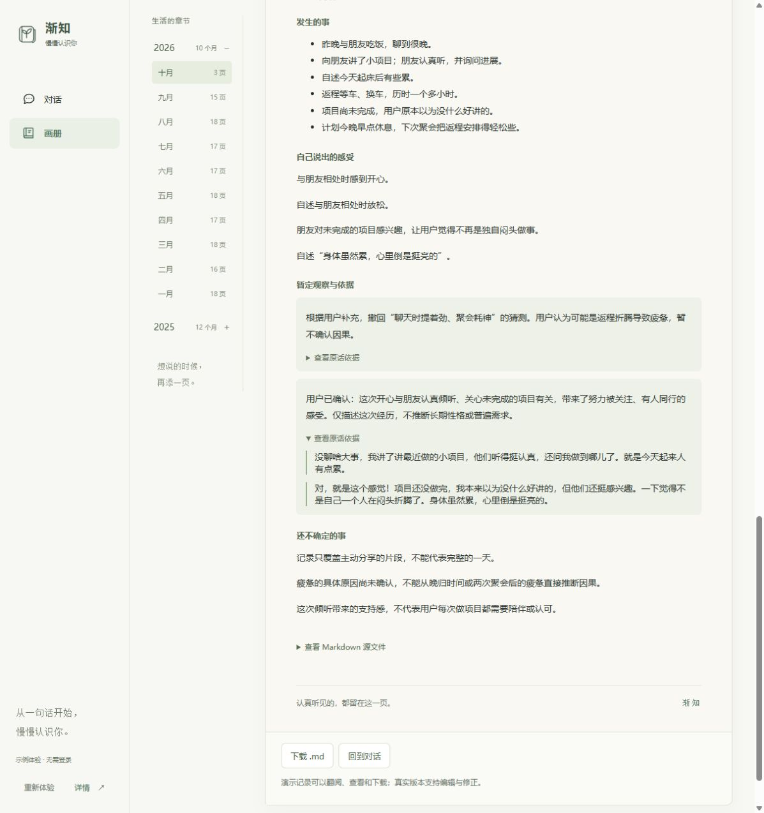

### 09：月份目录

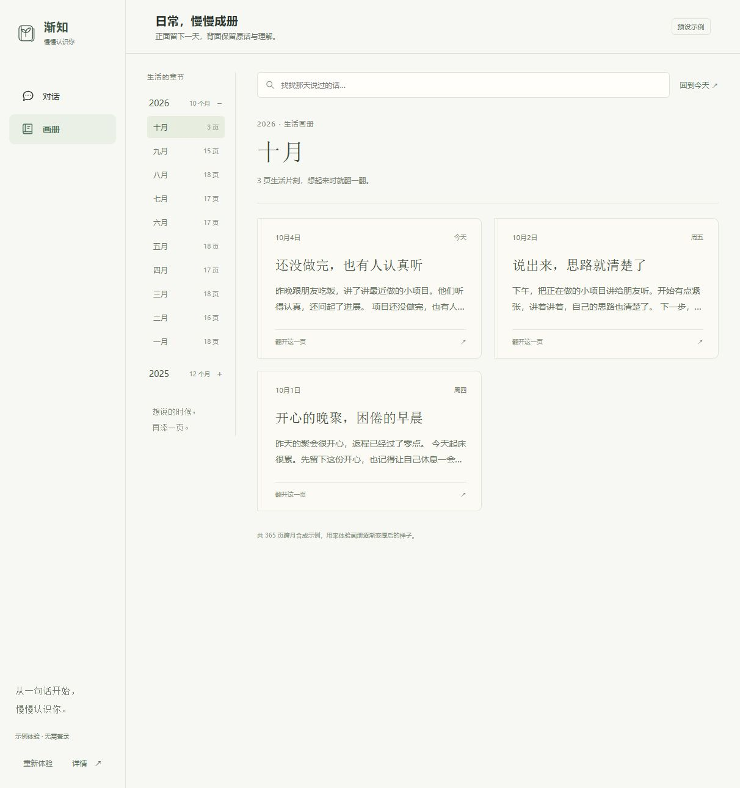

### 10：跨月搜索

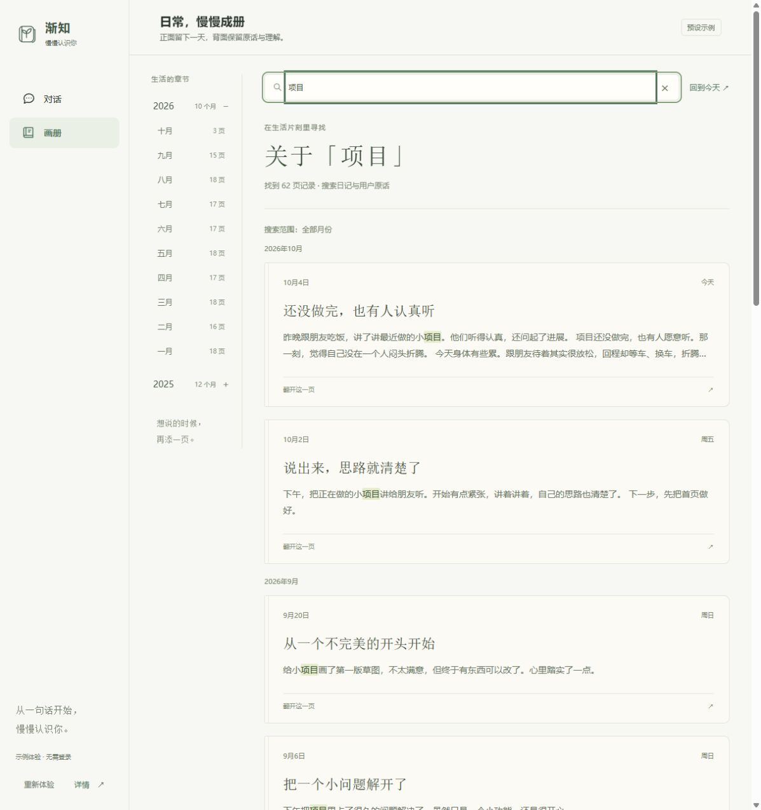

### 11：手机目录

### 12：手机对话结束

### 13：演示边界说明

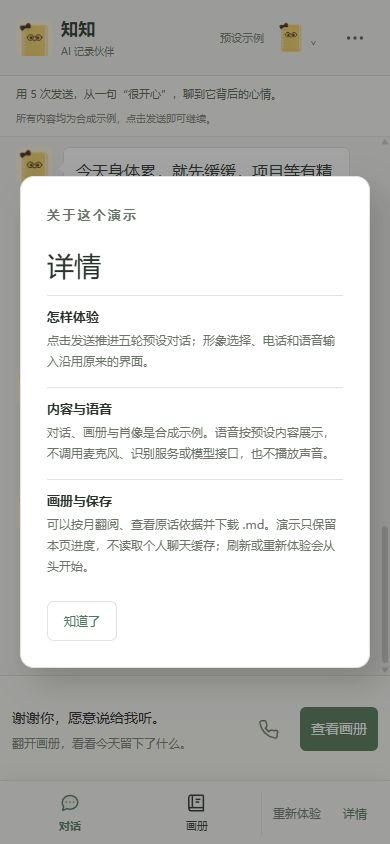

## 下一轮建议

先完成“纠正前后可见 + 来源可点开 + 今日肖像前置”，再补后续见面片段和技术实践说明。这样能沿用当前界面与固定故事，以较小改动提高评委理解产品创新的速度。
