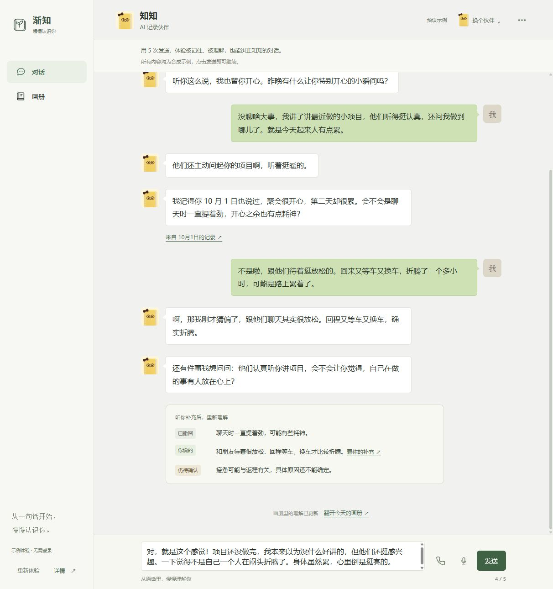
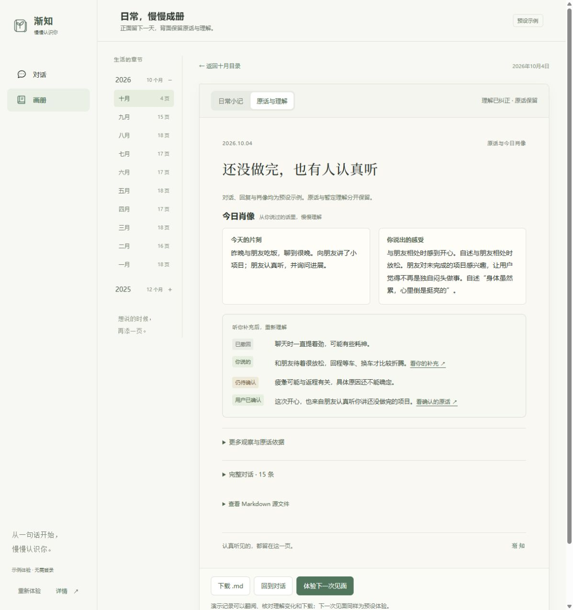
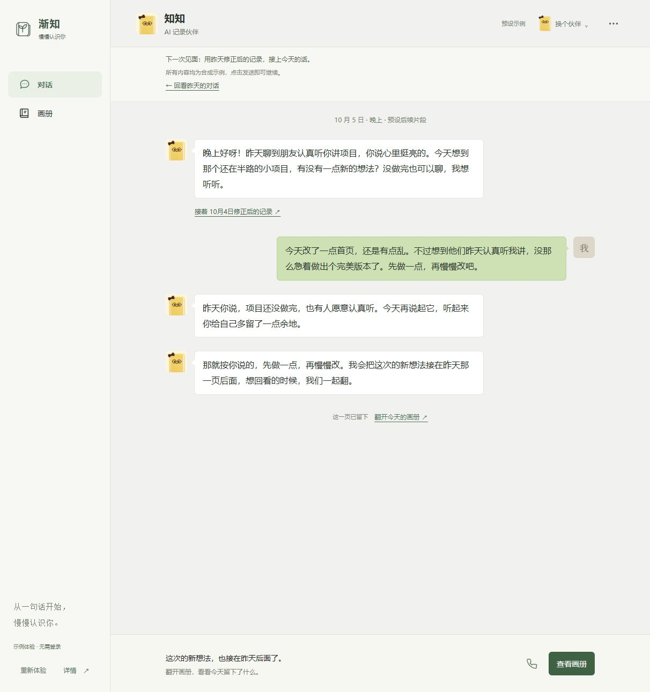
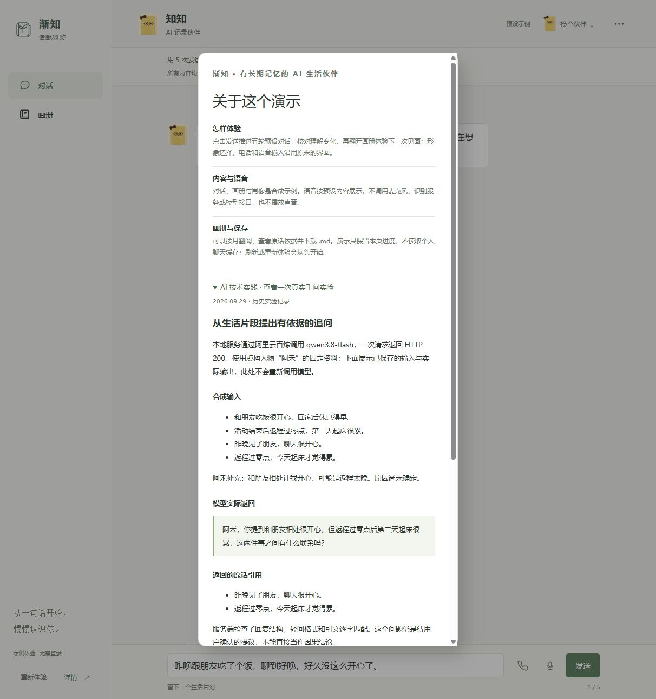

# 渐知：四项评委体验优化完成记录

日期：2026-10-04。承接[评委体验报告](judge-review-2026-10-04.md)中的四项主要建议。体验入口：http://127.0.0.1:5176/?demo=judge。

## 已完成

1. 历史来源与理解修订：10 月 1 日、10 月 2 日的引用可以点开对应原话。纠正后显示已撤回、用户补充、仍待确认；用户确认更深层感受后再增加已确认内容。画册中的确认和补充也能打开原话。
2. 今日肖像前置：背面先展示事件与感受、理解更新，再展开完整观察和依据。15 条完整对话默认折叠，所有原话与回复仍保留。Markdown 导出附带理解修订记录。
3. 下一次见面：完成五轮并打开画册后可进入预设的 10 月 5 日片段。引用 10 月 4 日修正后的原话，再通过一次发送生成独立日记页。两段交流可以来回查看，切换不会重播旧消息动效。重置会取消尚未完成的回复并清理两次进度。
4. AI 技术实践：详情展示一次已保存的真实千问实验的合成输入、实际问题、原话引用、校验方式与下载入口，明确预设流程、已验证实验、后续目标。[当前参赛文案](../marketing/2026-10-04-渐知参赛展示文案.md)统一使用渐知与知知，旧稿保留作历史资料。

沿用原聊天、形象选择、语音输入和通话 UI。所有新交互仍为合成演示，不访问个人聊天缓存、不触发麦克风、不调用模型。完整持续记忆模型链路与公开部署未包含在本次优化中。

## 验证

- `npm run build`：通过。
- `npm run lint`：通过。
- `npm test`：38 个文件、363 项测试通过。
- `npm run test:e2e -- tests/judge-demo.spec.ts tests/judge-tools.spec.ts tests/album-library.spec.ts`：7 项通过，覆盖完整主流程、来源弹窗、后续见面、记录保留、Markdown 文件内容、实验下载资源、重置、动效、原通话和移动端。
- 通过内置浏览器走完桌面与 390×844 手机的新流程。手机画册无横向溢出，详情弹窗可滚动；桌面今日肖像起始位置约 445 像素，原先约 2400 像素。
- 浏览器测试已实际下载并读取 Markdown，核对原话与理解修订。本轮不再沿用评审时未复核下载的结论。

## 新截图

### 理解被修正

### 今日肖像在首屏

### 下一次见面

### 真实 AI 实验说明

### 手机画册

