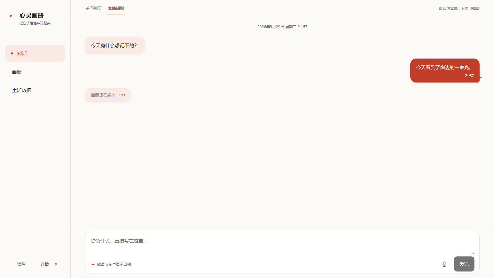
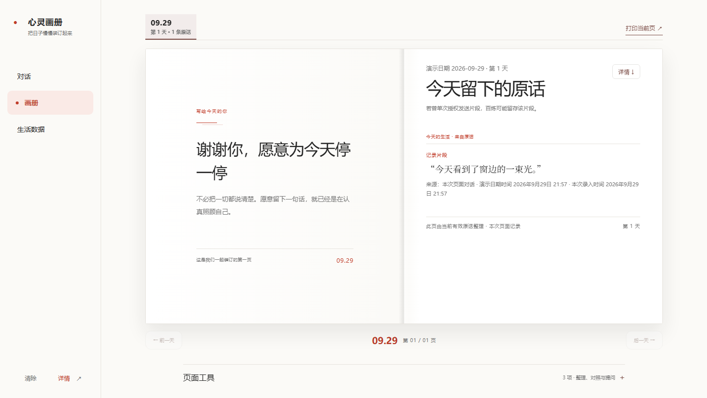
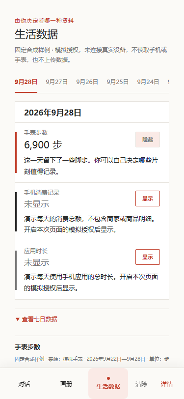

# 队友前端对齐记录（2026-09-29）

视觉与语音输入基于队友公开仓库 [LCX206/soul-album 的 `6fe3831`](https://github.com/LCX206/soul-album/tree/6fe3831d85287a685a6310187c4c410da902833a) 集成到现有产品。保留本地记录领域服务和本机千问逐轮发送预览；画册桌面双页、手机单页，翻页仅在已有记录日之间进行。所有截图使用合成文字和固定演示数值。

| 页面 | 截图 |
| --- | --- |
| 对话，桌面 |  |
| 画册，桌面 |  |
| 画册，手机 |  |
| 生活数据，手机 |  |

验证：234 项单元测试、80 项浏览器测试、lint、完整构建与 `git diff --check` 均通过；1440、375、320 像素宽度已检查。320 像素宽度没有页面横向滚动。`/soul-album/` 路径下，语音 Worker 用合成静音完成一次本地推理，模型和 WASM 请求均来自本站；不支持麦克风时仍可文字输入。本轮没有使用真实麦克风或真实用户音频，也没有发起新的百炼调用。

本机千问聊天仍只在本地服务启用时出现。在线 GitHub Pages 是静态规则版，不能调用本机千问接口；模拟生活数据也没有连接真实手表或手机。
