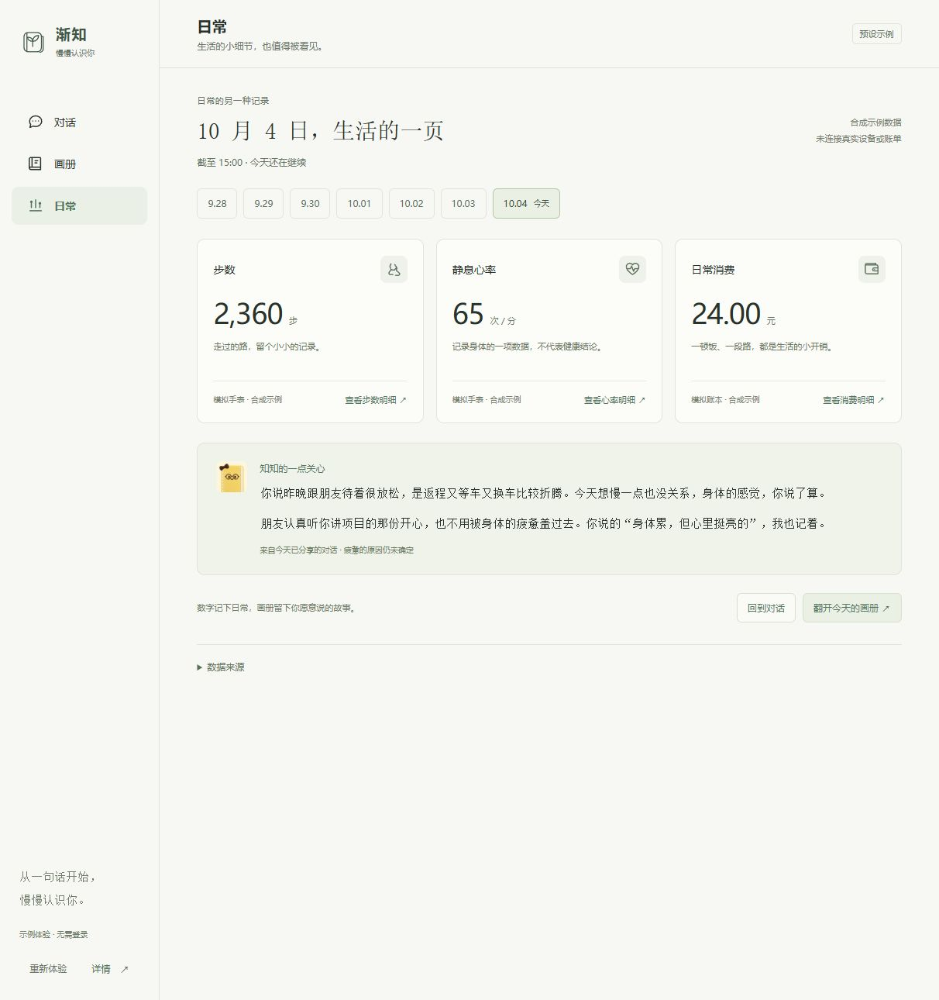

# 渐知前端交接 · 2026-10-04

当前版本在 [cyxhrh/soul-album 的 codex/teammate-frontend-integration 分支](https://github.com/cyxhrh/soul-album/tree/codex/teammate-frontend-integration)。这是 10 月 3 日交接之后的完整更新；旧文档保留为历史记录，本次体验以本文为准。

## 启动与入口

Node.js 24 与 npm。使用新目录克隆可避免影响队友已有未提交工作：

```bash
git clone --branch codex/teammate-frontend-integration https://github.com/cyxhrh/soul-album.git jianzhi-frontend-demo
cd jianzhi-frontend-demo
npm ci --ignore-scripts
npm run dev -- --host 127.0.0.1 --port 5176 --strictPort
```

浏览器打开 **http://127.0.0.1:5176/?demo=judge**。如果 5176 正在使用，可换一个端口，并在终端输出的地址后加 `?demo=judge`。普通 `/` 入口仍是可输入的聊天版本。

评委体验不需要模型 Key、后端服务、登录、录音或设备授权。电话与语音输入为原界面的预设交互演示，不会真正通话或录音。

## 体验路线

1. 对话首页点五次「发送」。知知主动开启话题、回看旧话、接受用户纠正，再理解朋友认真倾听项目带来的支持感。回复分成短信气泡，保留入场动效与两条回复之间 0.9 秒间隔。
2. 留意第一次回复后的「开心」表情与收尾关心后的「困困」表情。表情仅在知知形象下显示；可试用伙伴选择、电话和语音输入界面。
3. 从聊天中的来源链接打开历史原话，查看理解从「已撤回」到「用户已确认」的变化。
4. 画册按年、月和日期目录翻阅，支持搜索。打开今天的「日常小记」「原话与理解」；今日肖像在完整对话之前，原文与模型示例回复完整保留，可下载 Markdown。
5. 完成五轮后，从画册点「体验下一次见面」，用一次预设发送体验修正后的记忆如何接到次日。
6. 在「日常」看七日步数、静息心率和消费，切换日期、展开明细及消费组成。今日截至 15:00；数据来源可以逐项隐藏。知知的关心随已经到达的对话更新，不提前引用未发送的原话。
7. 「详情」包含演示范围及一次真实千问合成实验记录，区分已验证实验与预设 UI。

刷新或「重新体验」会清除本次评委体验的进度，恢复固定示例。所有聊天、记录、肖像及日常数值均为合成示例；本版本未读取私人资料、连接手表或账单。日常数值不会自动写入画册或肖像。

## 修改入口

| 想修改的部分 | 文件 |
| --- | --- |
| 开场、五轮消息、后续见面、每日肖像与日记 | `src/features/judge/judgeScript.ts` |
| 聊天界面、导航、流程与表情绑定 | `src/features/judge/JudgeDemo.tsx`、`judge-demo.css` |
| 原来的通话、语音预设与伙伴选择 UI | `src/features/judge/JudgeExperience.tsx` |
| 原话来源、理解更新、实验说明 | `src/features/judge/JudgeInsights.tsx` |
| 画册目录、搜索与月导航 | `src/features/album/AlbumLibrary.tsx`、`album-library.css` |
| 长期演示历史记录 | `src/features/judge/judgeHistory.ts` |
| 日常布局与关心 | `src/features/judge/JudgeDaily.tsx`、`judge-daily.css` |
| 日常数值、单位与来源 | `src/features/judge/judgeDailyData.ts` |
| 两张表情 PNG | `public/brand/stickers/` |

尽量保留消息 ID，它们用于来源引用、肖像证据与表情绑定。评委页和真实聊天页保持独立；无需改后端即可调整当前预设内容。

## 检查与在线网页

```bash
npm test
npm run lint
npm run build
npm run test:e2e -- tests/judge-demo.spec.ts tests/judge-tools.spec.ts tests/judge-daily.spec.ts tests/album-library.spec.ts
```

推送当前分支不会自动更新现有 GitHub Pages：部署工作流仅在 `main` 推送或手动启动时运行。仓库分支链接用于下载源码；上面的 `127.0.0.1` 地址需要在队友自己的电脑启动后才能访问。

页面示例与设计说明：[四项评委体验优化](../design/judge-upgrade-2026-10-04.md)、[日常页](../design/daily-life-2026-10-04.md)。


