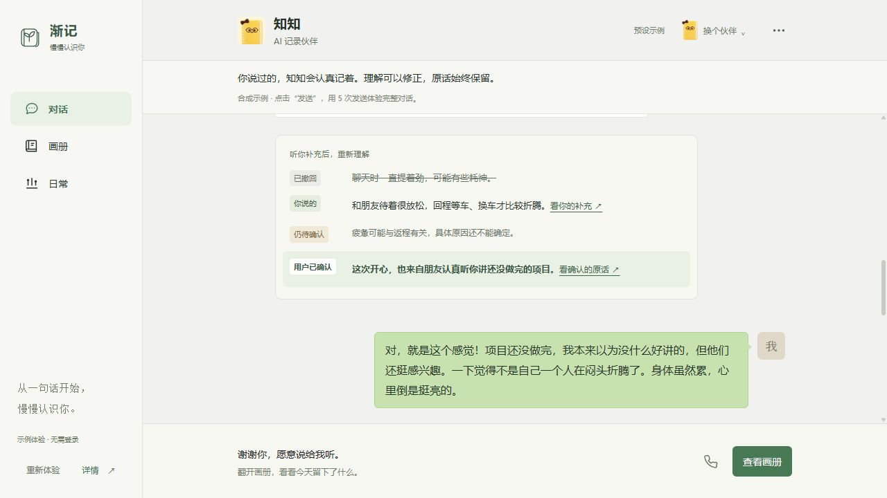

# 渐记 · 比赛提交准备包

**渐记日常，渐见自己。** 更新：2026-10-05。供队友检查、补齐并提交，尚未代填比赛表单。

先打开 [在线 Demo](https://cyxhrh.github.io/soul-album/)，再按下方顺序准备。提交材料与源码均在 `codex/teammate-frontend-integration` 分支；[打包下载](https://github.com/cyxhrh/soul-album/releases/tag/submission-2026-10-05)提供材料 ZIP 和已构建静态站点 ZIP。

## 已准备的材料

| 材料 | 用途 |
| --- | --- |
| [表单文案](form-copy.md) | 作品名、介绍、模型选项、201 字符 AI 技术实践说明、链接填写口径 |
| [体验与讲解指南](demo-guide.md) | 五轮对话 → 来源核对 → 理解修正 → 画册 → 日常 → 下一次见面 |
| [演示截图](screenshots/README.md) | 当前提交构建的实际界面，全部为合成示例 |
| [比赛横版封面](cover-1920x1080.png) | 1920 × 1080，16:9，PNG，可上传作品封面字段 |
| [Markdown 记录样例](sample-diary-2026-10-04.md) | 完整对话、精炼日记、今日肖像及理解修订，可在外部查阅和编辑 |
| [真实千问实验记录](../../../public/evidence/qwen-synthetic-trial-2026-09-29.md) | 2026-09-29 一次固定合成资料调用的输入、结果和校验记录 |
| [魔搭部署说明](deployment.md) | 根 Dockerfile、7860 端口、预设演示构建及静态包部署 |
| [字段与官方依据](requirements.md) | 区分已核对要求与待登录页面确认的字段 |
| [队友最终检查清单](teammate-review.md) | 完成账号信息、公开创空间链接和提交前验收 |
| [本轮验证记录](verification.md) | 构建、测试、浏览器体验和仍待完成的云端检查 |

## 队友接手顺序

1. 体验公开 Demo，检查五轮对话、原话与理解、日常、通话及伙伴选择。
2. 按 [部署说明](deployment.md) 创建公开 ModelScope 创空间。可用根 Dockerfile 构建，也可选择 Static SDK 上传静态 ZIP 解压后的内部文件。
3. 用未登录窗口访问创空间，走完主流程，并确认手机可用；记录最终空间链接和部署版本。
4. 按 [表单文案](form-copy.md) 粘贴内容，补队名、队员和联系方式；依实际表单核对作品图片、赛道、截止时刻及其他字段。
5. 按 [检查清单](teammate-review.md) 查漏补缺，最后由参赛人核对承诺条款并提交，保留成功回执。

**仍需队友完成：必填的 ModelScope 创空间公开地址、账号与队伍资料、云端匿名访问验收、最终表单提交。** GitHub Pages 是补充体验入口，不能替代截图中的创空间字段。未发布模型、数据集、Notebook、MCP、Skill 或实践内容时，对应选填项留空。

## 当前体验的能力边界

评委网页是离线预设流程，聊天、画册、次日衔接和设备数据均为合成示例。语音和通话保留交互界面，不录音、不调用识别或模型。原话保留、理解撤回和用户确认展示产品设计；持续跨日模型检索、真实设备接入与跨设备同步尚未完成。

另有普通模式的本地模型接线和一次真实千问实验记录，见源码与证据文档。不要把预设回复称为本轮实时 AI 输出，也不要据此申报已完成 AI PC 端云协同加分。

