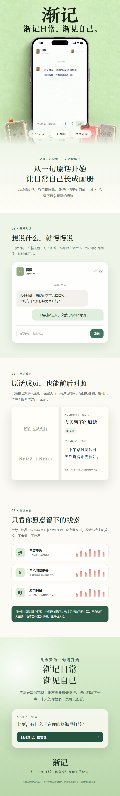

# 渐记：渐记日常，渐见自己

渐记是一款以日常对话为入口的 AI 生活伙伴原型。我们想让人不必每天写完整的日记，回复一个小问题，就能留下愿意分享的生活片段；以后回看时，既能看到整理后的记录，也能核对当时真正说过的话。

当前作品已上线魔搭创空间，采用无需登录的固定流程 Demo，方便体验从聊天、核对来源、纠正理解到翻阅画册的过程。

[打开渐记体验](https://cy189789-jianji.ms.show/) · [魔搭创空间项目页](https://modelscope.cn/studios/Cy189789/jianji)

## 从一个容易回答的问题开始

有时我们只是想聊聊昨天的一顿饭、最近做的小项目，或者今天为什么有些累。面对空白输入框，却未必知道从哪里说起。

因此，渐记里的伙伴会先提出一个具体、轻松的话题，留给用户接话的空间。我们设计了伙伴形象选择、语音输入和通话界面，让不同的人可以选择习惯的交流方式。当前评委 Demo 中，文字对话为预设流程，语音和通话提供界面预览。

## 理解需要依据，也需要修正

演示里，用户说昨晚和朋友聊天很开心，今天起床却有些累。伙伴联系了之前的记录，试着询问：是不是聊天时有些费神？

用户随即补充：和朋友待着很放松，回程等车、换车，折腾了一个多小时，可能是路上累了。伙伴据此撤回原先的猜测，再问起朋友认真听自己讲项目时的感受。

接下来，用户说出了更在意的部分：项目还没有做完，朋友却愿意认真听，这让自己感到踏实。

这段流程展示的是我们希望建立的交流方式：先回应具体经历，再提出可以回答的追问；猜测要留有余地，用户的解释能改变已有记录。被认真听见的感受，由用户自己说出并确认。

## 同一天的记录，有两种读法

画册的日记页保留标题和精炼的小记，方便以后翻阅。详细记录则保留完整对话、原话依据、理解修订，以及根据当天内容形成的暂定肖像。

用户可以前后对照，也可以查看、下载 Markdown，在外部查阅和编辑。年月目录与搜索让积累的记录更容易找到。这些内容为后续模型读取和理解提供记录结构；持续跨日检索仍在后续开发计划中。

我们也设计了日常数据页，展示步数、静息心率和消费记录的来源与趋势。它们可以帮助补充生活背景，但单个数值不能直接解释一个人的心情。当前页面使用合成数据，开关控制示例是否显示，尚未连接真实设备或账单。

## AI 实践与当前完成程度

普通模式通过本地服务调用阿里云百炼的千问，支持配置模型后的同日连续聊天，以及手动整理当日日记和暂定肖像。

2026 年 9 月 29 日，我们以虚构人物“阿禾”的固定生活片段完成了一次真实千问请求。模型生成一句轻问和两条原话引用；服务端校验返回结构、问题格式与引文是否逐字一致。固定输入、返回文本、参数和人工复核结果已整理为[公开实验记录](https://github.com/cyxhrh/soul-album/blob/codex/teammate-frontend-integration/public/evidence/qwen-synthetic-trial-2026-09-29.md)。这次实验验证了固定资料下的调用与校验过程，尚不能证明开放输入或长期使用时的提问质量。

提交给评委的在线网页采用离线预设流程，五次发送即可体验完整对话，并查看来源核对、理解修订、画册、日常数据与次日衔接。对话和设备数据均为合成示例，回复不在体验时实时生成。持续跨日模型检索、真实设备接入与跨设备同步尚未完成。

## 宣传视频与体验入口

[观看或下载渐记宣传片（90 秒，1920 × 1080）](https://github.com/cyxhrh/soul-album/releases/download/submission-2026-10-05/jianji-promo-v4-creative-minds-2026-10-05.mp4)

宣传图为产品设计展示，视频包含界面演示与合成情境。当前已完成的能力，以在线 Demo、源码和实验记录为准。

- [直接体验渐记](https://cy189789-jianji.ms.show/)
- [魔搭创空间](https://modelscope.cn/studios/Cy189789/jianji)
- [源码与提交材料](https://github.com/cyxhrh/soul-album/tree/codex/teammate-frontend-integration/docs/submission/2026-10-05)

欢迎体验后告诉我们：开场问题是否容易接话，伙伴的追问是否贴近你的感受，以及你是否愿意回来看这些记录。
